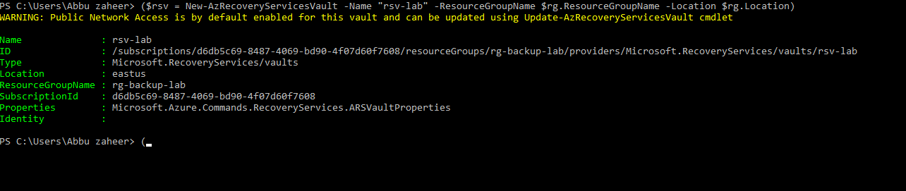
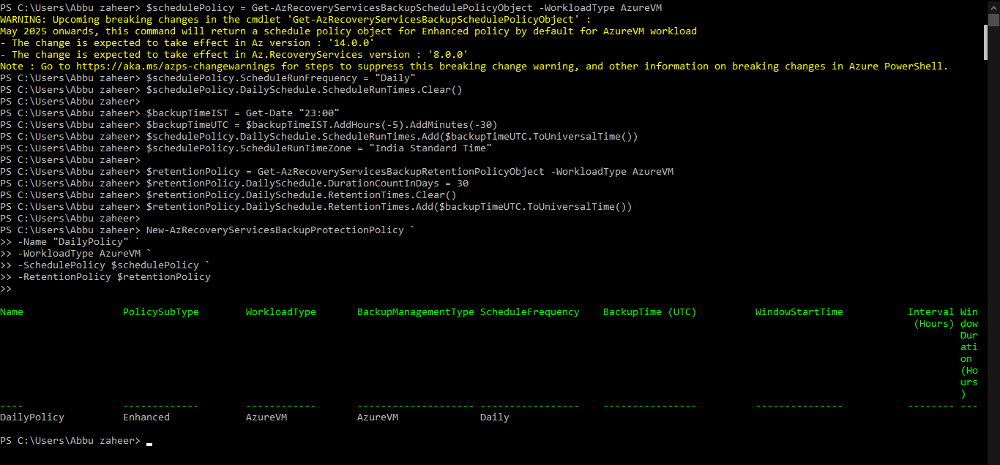

# Lab 6: Azure Backup (Configuration & Monitoring)

## 🎯 Objective
Configure Azure Backup using a Recovery Services Vault, apply backup policies to virtual machines, and validate restore point creation for business continuity and disaster recovery (BCDR).

## ⚙️ Resources Deployed
| Resource Type | Name / Configuration |
|---|---|
| Resource Group | rg-backup-lab |
| Recovery Services Vault | rsv-lab |
| Virtual Machine | vm-backup |
| Backup Policy | Daily backup with 30-day retention |
| Backup Type | Azure VM Backup |
| Retention Period | 30 Days |

## Deployment Scope
 
This lab focused on configuring Azure Backup for Infrastructure-as-a-Service (IaaS) virtual machines using Azure Recovery Services Vault. The deployment included backup policy creation, VM backup enablement, monitoring of backup jobs, and validation of restore point behavior using Azure PowerShell. The lab also covered troubleshooting backup policy configuration issues related to UTC scheduling and timezone settings.

## 📸 Screenshots

### **Recovery Services Vault Creation**  
Provisioned a Recovery Services Vault named `rsv-lab` in the resource group.  

### **Vault Listing**  
Confirmed the vault exists and is properly configured.  

### **Backup Policy Configuration (Initial Error)**  
Initial backup policy configuration failed because the backup schedule time was not specified in UTC format.

### **Backup Policy Configuration (Corrected Configuration)**  
Corrected the backup schedule by converting the time to UTC format and successfully created the backup policy

### **VM Backup Enablement**  
Enabled backup for the VM `vm-backup` using the corrected policy.  

### **Backup Job Execution (In Progress)**  
Triggered an on-demand backup job and verified that the backup operation entered the InProgress state successfully. 

### **Restore Point Verification**  
Verified restore point availability after initiating the backup job. No restore points were displayed because the backup operation had not completed at the time of validation.

## Operational Validation
 
| Validation Task | Result |
|---|---|
| Recovery Services Vault creation | Successful |
| Backup policy creation | Initially failed due to UTC scheduling issue |
| Backup policy correction | Successful after UTC conversion |
| VM backup enablement | Completed successfully |
| On-demand backup trigger | Backup job entered InProgress state |
| Restore point verification | No restore points displayed because backup job had not completed |

---

## 📚 Key Learnings
- How to provision and configure a Recovery Services Vault.
- How to create and apply backup policies to Azure VMs.
- Importance of converting backup schedules to UTC and specifying the correct timezone.
- How to enable VM backup protection using Azure PowerShell.
- How to trigger and monitor on-demand backup jobs.
- Understanding that restore points become available only after backup job completion.
- Importance of operational monitoring and validation in backup workflows.

## 📌 Resume Alignment
- Configured Azure Backup using Recovery Services Vault and implemented VM backup policies with 30-day retention.
- Troubleshot and resolved Azure Backup policy configuration issues related to UTC scheduling and timezone settings.
- Executed and monitored on-demand VM backup operations using Azure PowerShell.
- Validated backup job execution and restore point behavior within Azure Recovery Services.
- Demonstrated operational backup monitoring and disaster recovery readiness in Azure environments.
