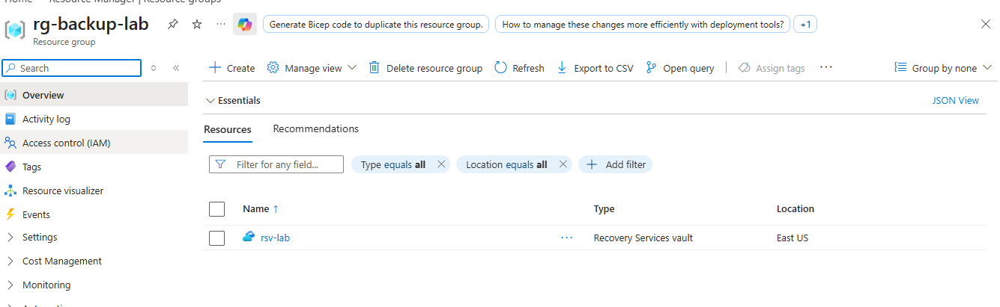
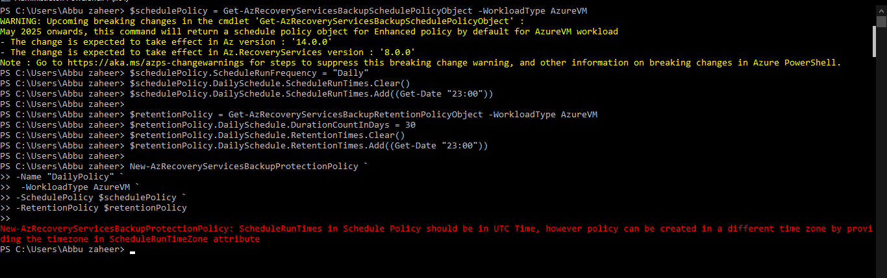
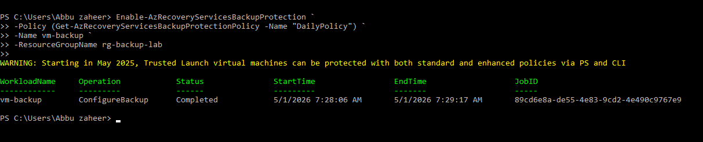
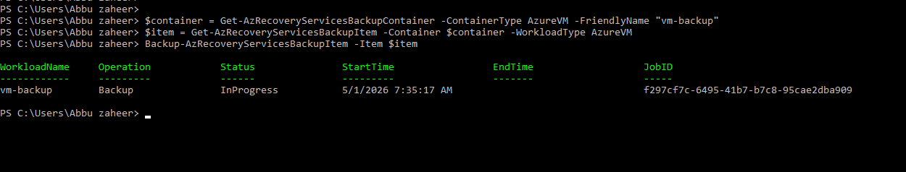
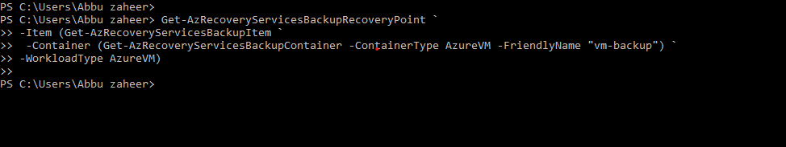

# Lab 6: Azure Backup & Recovery

## 🎯 Objective
Configure Azure Backup using a Recovery Services Vault, apply backup policies to virtual machines, and validate restore point creation for business continuity and disaster recovery (BCDR).

## ⚙️ Resources Deployed
- Resource Group: rg-backup-lab
- Recovery Services Vault: rsv-lab
- Virtual Machine: vm-backup
- Backup Policy: Daily backup with 30‑day retention

## 📸 Screenshots

**Recovery Services Vault Creation**  
Provisioned a Recovery Services Vault named `rsv-lab` in the resource group.  

**Vault Listing**  
Confirmed the vault exists and is properly configured.  

**Backup Policy Configuration – Error Encountered**  
Initially, a policy creation error occurred because the backup time was not converted to UTC.  

**Backup Policy Configuration – Corrected**  
After converting the backup time to UTC and specifying the timezone, the policy was successfully created.  

**VM Backup Enablement**  
Enabled backup for the VM `vm-backup` using the corrected policy.  

**Backup Job Execution (In Progress)**  
Triggered an on‑demand backup. The job status showed **InProgress** but did not complete before resources were deleted.  

**Restore Point Verification (No Output)**  
Checked for restore points, but none were listed since the backup job had not yet finished.  

---

## 📚 Key Learnings
- How to provision and configure a Recovery Services Vault.  
- How to create and apply backup policies to Azure VMs.  
- Importance of converting backup times to **UTC** and specifying the correct timezone.  
- How to trigger backup jobs and monitor their status.  
- Understanding that restore points only appear after a backup job completes.  
- Resource cleanup is an important part of lab lifecycle management.

## 📌 Resume Bullets
- Configured Azure Backup using Recovery Services Vault and applied VM backup policies.  
- Troubleshot and resolved backup policy errors related to timezone configuration.  
- Executed an on‑demand backup job and validated monitoring steps, even when restore points were not yet available.  
- Demonstrated disaster recovery readiness and resource lifecycle management in Azure.  
